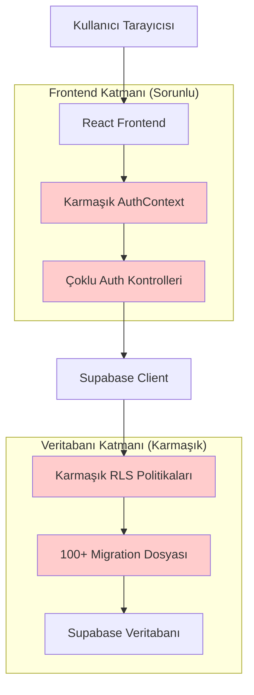
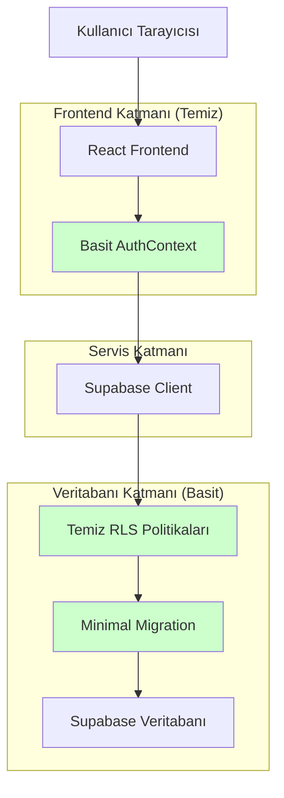
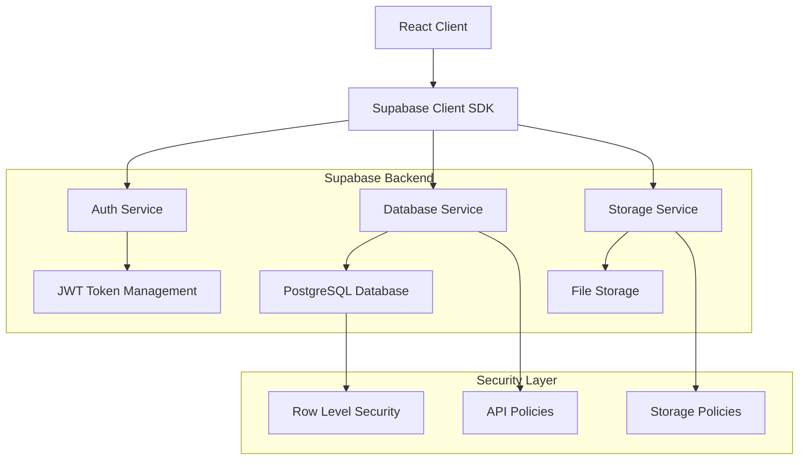
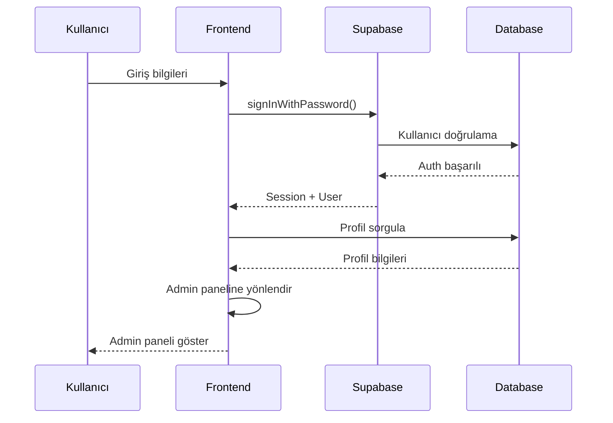
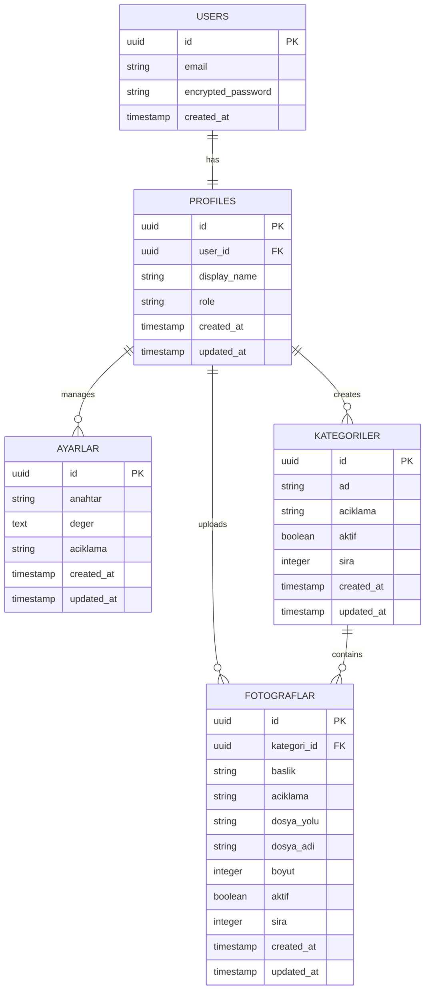

# Teknik Mimari Düzeltme Planı

## 1. Mimari Tasarım

### 1.1 Mevcut Mimari (Sorunlu)


### 1.2 Hedef Mimari (Referans Projeden)


## 2. Teknoloji Açıklaması

### 2.1 Mevcut Teknolojiler (Korunacak)
- **Frontend**: React@18 + TypeScript + Vite
- **UI Framework**: Tailwind CSS + Shadcn/ui
- **Backend**: Supabase (PostgreSQL + Auth + Storage)
- **State Management**: React Hooks (useState, useEffect, useContext)
- **Routing**: React Router DOM

### 2.2 Kaldırılacak Karmaşıklıklar
- ❌ Çoklu auth kontrol mekanizmaları
- ❌ Gereksiz error handling katmanları
- ❌ Karmaşık rol yönetimi
- ❌ Fazla migration dosyaları
- ❌ Aşırı detaylı RLS politikaları

### 2.3 Eklenecek Basitlikler
- ✅ Tek auth kontrol noktası
- ✅ Basit error handling
- ✅ Minimal rol sistemi (admin/user)
- ✅ Temiz migration yapısı
- ✅ 4 temel RLS politikası

## 3. Route Tanımları

### 3.1 Mevcut Route Yapısı
| Route | Amaç | Durum |
|-------|------|-------|
| `/` | Ana sayfa | ✅ Çalışıyor |
| `/auth` | Giriş sayfası | ⚠️ Karmaşık |
| `/admin` | Yönetim paneli | ❌ Boş sayfa |
| `/admin/*` | Alt sayfalar | ❌ Erişilemiyor |

### 3.2 Düzeltilmiş Route Yapısı
| Route | Amaç | Yeni Durum |
|-------|------|------------|
| `/` | Ana sayfa | ✅ Korunacak |
| `/auth` | Basit giriş sayfası | ✅ Sadeleştirilecek |
| `/admin` | Çalışan yönetim paneli | ✅ Düzeltilecek |
| `/admin/ayarlar` | Ayarlar yönetimi | ✅ CRUD çalışacak |
| `/admin/galeriler` | Galeri yönetimi | ✅ CRUD çalışacak |
| `/admin/kategoriler` | Kategori yönetimi | ✅ CRUD çalışacak |

## 4. API Tanımları

### 4.1 Supabase Auth API

#### Giriş İşlemi
```typescript
// Basitleştirilmiş giriş
POST /auth/v1/token?grant_type=password
```

**İstek:**
| Parametre | Tip | Zorunlu | Açıklama |
|-----------|-----|---------|----------|
| email | string | true | Kullanıcı e-postası |
| password | string | true | Kullanıcı şifresi |

**Yanıt:**
| Parametre | Tip | Açıklama |
|-----------|-----|----------|
| access_token | string | JWT token |
| user | object | Kullanıcı bilgileri |
| session | object | Oturum bilgileri |

**Örnek:**
```json
{
  "email": "admin@kumlu2.com",
  "password": "123456"
}
```

#### Profil İşlemleri
```typescript
// Profil okuma
GET /rest/v1/profiles?user_id=eq.{user_id}
```

**Yanıt:**
```json
{
  "id": "uuid",
  "user_id": "uuid",
  "display_name": "Admin",
  "role": "admin",
  "created_at": "2024-01-01T00:00:00Z",
  "updated_at": "2024-01-01T00:00:00Z"
}
```

### 4.2 CRUD API'leri

#### Ayarlar Yönetimi
```typescript
// Ayarları listeleme
GET /rest/v1/ayarlar

// Ayar güncelleme
PATCH /rest/v1/ayarlar?id=eq.{id}
```

#### Galeri Yönetimi
```typescript
// Fotoğrafları listeleme
GET /rest/v1/fotograflar

// Fotoğraf ekleme
POST /rest/v1/fotograflar

// Fotoğraf silme
DELETE /rest/v1/fotograflar?id=eq.{id}
```

#### Kategori Yönetimi
```typescript
// Kategorileri listeleme
GET /rest/v1/kategoriler

// Kategori ekleme
POST /rest/v1/kategoriler

// Kategori güncelleme
PATCH /rest/v1/kategoriler?id=eq.{id}
```

## 5. Sunucu Mimarisi

### 5.1 Supabase Servis Katmanları


### 5.2 Auth Flow Düzeltmesi


## 6. Veri Modeli

### 6.1 Veri Modeli Tanımı



### 6.2 Veri Tanımlama Dili (DDL)

#### Profiles Tablosu (Yeniden Oluşturulacak)
```sql
-- Mevcut karmaşık yapıyı temizle
DROP TABLE IF EXISTS public.profiles CASCADE;
DROP TABLE IF EXISTS public.kullanici_rolleri CASCADE;

-- Basit profiles tablosu oluştur
CREATE TABLE public.profiles (
    id uuid NOT NULL DEFAULT gen_random_uuid() PRIMARY KEY,
    user_id uuid NOT NULL UNIQUE REFERENCES auth.users(id) ON DELETE CASCADE,
    display_name text,
    role text DEFAULT 'user' CHECK (role IN ('user', 'admin')),
    created_at timestamp with time zone NOT NULL DEFAULT now(),
    updated_at timestamp with time zone NOT NULL DEFAULT now()
);

-- İndeksler
CREATE INDEX idx_profiles_user_id ON public.profiles(user_id);
CREATE INDEX idx_profiles_role ON public.profiles(role);

-- RLS etkinleştir
ALTER TABLE public.profiles ENABLE ROW LEVEL SECURITY;

-- Basit RLS politikaları
CREATE POLICY "Kullanıcılar kendi profilini görebilir" 
ON public.profiles FOR SELECT 
USING (auth.uid() = user_id);

CREATE POLICY "Kullanıcılar kendi profilini güncelleyebilir" 
ON public.profiles FOR UPDATE 
USING (auth.uid() = user_id);

CREATE POLICY "Kullanıcılar kendi profilini oluşturabilir" 
ON public.profiles FOR INSERT 
WITH CHECK (auth.uid() = user_id);

CREATE POLICY "Adminler tüm profilleri görebilir"
ON public.profiles FOR ALL
USING (
  EXISTS (
    SELECT 1 FROM public.profiles 
    WHERE user_id = auth.uid() 
    AND role = 'admin'
  )
);

-- Yeni kullanıcı için otomatik profil oluşturma
CREATE OR REPLACE FUNCTION public.handle_new_user()
RETURNS trigger
LANGUAGE plpgsql
SECURITY DEFINER SET search_path = ''
AS $$
BEGIN
  INSERT INTO public.profiles (user_id, display_name, role)
  VALUES (
    NEW.id, 
    COALESCE(NEW.raw_user_meta_data ->> 'display_name', split_part(NEW.email, '@', 1)),
    CASE 
      WHEN NEW.email = 'admin@kumlu2.com' THEN 'admin'
      ELSE 'user'
    END
  );
  RETURN NEW;
END;
$$;

-- Trigger
DROP TRIGGER IF EXISTS on_auth_user_created ON auth.users;
CREATE TRIGGER on_auth_user_created
  AFTER INSERT ON auth.users
  FOR EACH ROW EXECUTE FUNCTION public.handle_new_user();

-- Updated_at trigger
CREATE OR REPLACE FUNCTION public.update_updated_at_column()
RETURNS TRIGGER AS $$
BEGIN
    NEW.updated_at = now();
    RETURN NEW;
END;
$$ language 'plpgsql';

CREATE TRIGGER update_profiles_updated_at 
    BEFORE UPDATE ON public.profiles 
    FOR EACH ROW EXECUTE FUNCTION public.update_updated_at_column();

-- İlk admin kullanıcısı oluştur (eğer yoksa)
INSERT INTO auth.users (id, email, encrypted_password, email_confirmed_at, created_at, updated_at)
VALUES (
  gen_random_uuid(),
  'admin@kumlu2.com',
  crypt('123456', gen_salt('bf')),
  now(),
  now(),
  now()
) ON CONFLICT (email) DO NOTHING;
```

#### Ayarlar Tablosu RLS
```sql
-- Ayarlar tablosu için RLS
ALTER TABLE public.ayarlar ENABLE ROW LEVEL SECURITY;

-- Sadece adminler ayarları yönetebilir
CREATE POLICY "Adminler ayarları yönetebilir"
ON public.ayarlar FOR ALL
USING (
  EXISTS (
    SELECT 1 FROM public.profiles 
    WHERE user_id = auth.uid() 
    AND role = 'admin'
  )
);

-- Herkese okuma izni (genel ayarlar için)
CREATE POLICY "Herkes genel ayarları okuyabilir"
ON public.ayarlar FOR SELECT
USING (true);
```

#### Kategoriler Tablosu RLS
```sql
-- Kategoriler tablosu için RLS
ALTER TABLE public.kategoriler ENABLE ROW LEVEL SECURITY;

-- Adminler kategori yönetebilir
CREATE POLICY "Adminler kategorileri yönetebilir"
ON public.kategoriler FOR ALL
USING (
  EXISTS (
    SELECT 1 FROM public.profiles 
    WHERE user_id = auth.uid() 
    AND role = 'admin'
  )
);

-- Herkese okuma izni
CREATE POLICY "Herkes kategorileri okuyabilir"
ON public.kategoriler FOR SELECT
USING (aktif = true);
```

#### Fotoğraflar Tablosu RLS
```sql
-- Fotoğraflar tablosu için RLS
ALTER TABLE public.fotograflar ENABLE ROW LEVEL SECURITY;

-- Adminler fotoğraf yönetebilir
CREATE POLICY "Adminler fotoğrafları yönetebilir"
ON public.fotograflar FOR ALL
USING (
  EXISTS (
    SELECT 1 FROM public.profiles 
    WHERE user_id = auth.uid() 
    AND role = 'admin'
  )
);

-- Herkese aktif fotoğrafları okuma izni
CREATE POLICY "Herkes aktif fotoğrafları okuyabilir"
ON public.fotograflar FOR SELECT
USING (aktif = true);
```

#### Storage Bucket Politikaları
```sql
-- Fotoğraf bucket'ı için politikalar
INSERT INTO storage.buckets (id, name, public) 
VALUES ('fotograflar', 'fotograflar', true)
ON CONFLICT (id) DO NOTHING;

-- Adminler fotoğraf yükleyebilir
CREATE POLICY "Adminler fotoğraf yükleyebilir"
ON storage.objects FOR INSERT
WITH CHECK (
  bucket_id = 'fotograflar' AND
  EXISTS (
    SELECT 1 FROM public.profiles 
    WHERE user_id = auth.uid() 
    AND role = 'admin'
  )
);

-- Adminler fotoğraf silebilir
CREATE POLICY "Adminler fotoğraf silebilir"
ON storage.objects FOR DELETE
USING (
  bucket_id = 'fotograflar' AND
  EXISTS (
    SELECT 1 FROM public.profiles 
    WHERE user_id = auth.uid() 
    AND role = 'admin'
  )
);

-- Herkese okuma izni
CREATE POLICY "Herkes fotoğrafları görebilir"
ON storage.objects FOR SELECT
USING (bucket_id = 'fotograflar');
```

## 7. Uygulama Stratejisi

### 7.1 Aşamalı Geçiş Planı

#### Aşama 1: Backup ve Hazırlık
```bash
# Mevcut veritabanını yedekle
pg_dump -h [supabase-host] -U postgres -d postgres > backup_$(date +%Y%m%d).sql

# Test ortamı kur
cp -r kumlu2-master-15.08 kumlu2-test
```

#### Aşama 2: Auth Düzeltmeleri
1. **AuthContext.tsx** sadeleştir
2. **Auth.tsx** karmaşıklığı kaldır
3. **Admin.tsx** boş sayfa sorununu çöz

#### Aşama 3: Veritabanı Temizliği
1. Gereksiz migration dosyalarını sil
2. Profiles tablosunu yeniden oluştur
3. RLS politikalarını sadeleştir

#### Aşama 4: CRUD Testleri
1. Ayarlar CRUD test et
2. Kategoriler CRUD test et
3. Fotoğraflar CRUD test et

### 7.2 Rollback Planı

```sql
-- Acil durum rollback
-- 1. Backup'tan geri yükle
psql -h [supabase-host] -U postgres -d postgres < backup_20240101.sql

-- 2. Eski migration'ları geri çalıştır
-- 3. Eski kod versiyonuna dön
git checkout [previous-commit]
```

## 8. Performans Optimizasyonları

### 8.1 Veritabanı Optimizasyonları
```sql
-- Gerekli indeksler
CREATE INDEX CONCURRENTLY idx_fotograflar_kategori_aktif 
ON public.fotograflar(kategori_id, aktif) 
WHERE aktif = true;

CREATE INDEX CONCURRENTLY idx_kategoriler_aktif_sira 
ON public.kategoriler(aktif, sira) 
WHERE aktif = true;

-- Sorgu optimizasyonu için
ANALYZE public.profiles;
ANALYZE public.fotograflar;
ANALYZE public.kategoriler;
```

### 8.2 Frontend Optimizasyonları
```typescript
// React Query ile cache yönetimi
import { useQuery, useMutation, useQueryClient } from '@tanstack/react-query';

// Lazy loading
const AdminPanel = lazy(() => import('./components/AdminPanel'));

// Memoization
const MemoizedGallery = memo(GalleryComponent);
```

## 9. Güvenlik Önlemleri

### 9.1 Auth Güvenliği
```typescript
// JWT token doğrulama
const validateToken = async (token: string) => {
  const { data, error } = await supabase.auth.getUser(token);
  return !error && data.user;
};

// Rate limiting (Supabase tarafında)
// API çağrılarını sınırla
```

### 9.2 RLS Güvenliği
```sql
-- Güvenlik testleri
-- Admin olmayan kullanıcı test et
SET ROLE authenticated;
SET request.jwt.claims TO '{"sub":"non-admin-user-id"}';

-- Admin kullanıcı test et
SET request.jwt.claims TO '{"sub":"admin-user-id"}';
```

## 10. Monitoring ve Logging

### 10.1 Hata İzleme
```typescript
// Error boundary
class ErrorBoundary extends Component {
  componentDidCatch(error: Error, errorInfo: ErrorInfo) {
    console.error('Auth Error:', error, errorInfo);
    // Sentry veya başka bir servis
  }
}

// API hata loglama
const logError = (error: any, context: string) => {
  console.error(`[${context}]`, error);
  // Analytics servisine gönder
};
```

### 10.2 Performance Monitoring
```typescript
// Sayfa yükleme süreleri
const measurePageLoad = (pageName: string) => {
  const startTime = performance.now();
  return () => {
    const endTime = performance.now();
    console.log(`${pageName} yükleme süresi: ${endTime - startTime}ms`);
  };
};
```

## 11. Sonuç ve Beklentiler

### 11.1 Teknik Hedefler
- ✅ %100 çalışan auth sistemi
- ✅ Tüm CRUD işlemleri fonksiyonel
- ✅ Sayfa yükleme süresi < 2 saniye
- ✅ Hata oranı < %1
- ✅ Kod karmaşıklığı %70 azalma

### 11.2 İş Hedefleri
- ✅ Kullanıcı deneyimi iyileştirmesi
- ✅ Geliştirici verimliliği artışı
- ✅ Bakım maliyeti azalması
- ✅ Yeni özellik ekleme hızı artışı

### 11.3 Başarı Metrikleri
- **Auth Başarı Oranı**: %100
- **CRUD İşlem Başarı Oranı**: %100
- **Sayfa Yükleme Süresi**: < 2s
- **Kod Satır Sayısı**: %50 azalma
- **Migration Dosya Sayısı**: 100+ → 5
- **RLS Politika Sayısı**: 100+ → 12

Bu teknik mimari planı, referans projedeki basit ve etkili yapıyı temel alarak mevcut uygulamanın tüm sorunlarını çözecek ve sürdürülebilir bir sistem oluşturacaktır.